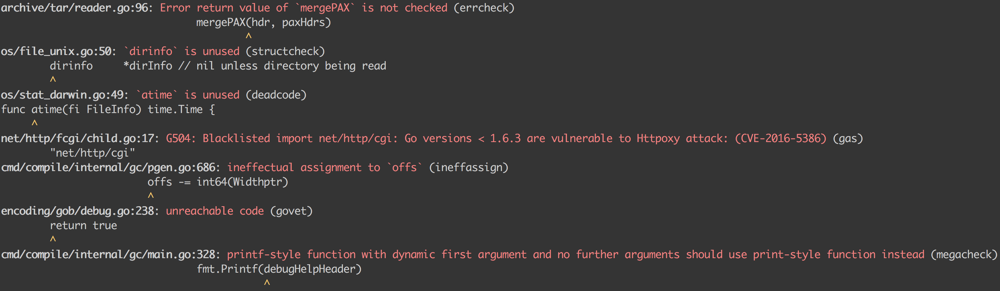

# GolangCI-Lint
[](https://travis-ci.com/golangci/golangci-lint)

GolangCI-Lint is a linters aggregator. It's fast: on average [5 times faster](#performance) than gometalinter. It's [easy to integrate and use](#issues-options), has [nice output](#quick-start) and has minimum number of false positives.

Sponsored by [GolangCI.com](https://golangci.com): SaaS service for running linters on Github pull requests. Free for Open Source.

<a href="https://golangci.com/"></a>

   * [Install](#install)
   * [Demo](#demo)
   * [Quick Start](#quick-start)
   * [Comparison](#comparison)
      * [<code>golangci-lint</code> vs <code>gometalinter</code>](#golangci-lint-vs-gometalinter)
      * [<code>golangci-lint</code> vs Run Needed Linters Manually](#golangci-lint-vs-run-needed-linters-manually)
   * [Performance](#performance)
      * [Comparison with gometalinter](#comparison-with-gometalinter)
   * [Supported Linters](#supported-linters)
      * [Enabled By Default Linters](#enabled-by-default-linters)
      * [Disabled By Default Linters (-E/--enable)](#disabled-by-default-linters--e--enable)
   * [Configuration](#configuration)
      * [Command-Line Options](#command-line-options)
      * [Configuration File](#configuration-file)
   * [False Positives](#false-positives)
   * [Internals](#internals)
   * [FAQ](#faq)
   * [Thanks](#thanks)
   * [Future Plans](#future-plans)

# Install
```bash
go get -u github.com/golangci/golangci-lint/cmd/golangci-lint
```

# Demo
Example of output:


Short 2 min video demo of analyzing [beego](https://github.com/astaxie/beego).
[](https://asciinema.org/a/183318)

# Quick Start
To run golangci-lint execute:
```bash
golangci-lint run
```

It's and equivalent of executing:
```bash
golangci-lint run ./...
```

You can choose which directories and files to analyze:
```bash
golangci-lint run dir1 dir2/... dir3/file1.go
```
Directories are analyzed NOT recursively, to analyze them recursively append `/...` to their path.

GolangCI-Lint can be used with zero configuration. By default next linters are enabled:
```
$ golangci-lint linters
Enabled by default linters:
govet: Vet examines Go source code and reports suspicious constructs, such as Printf calls whose arguments do not align with the format string
errcheck: Errcheck is a program for checking for unchecked errors in go programs. These unchecked errors can be critical bugs in some cases
staticcheck: Staticcheck is go vet on steroids, applying a ton of static analysis checks
unused: Checks Go code for unused constants, variables, functions and types
gosimple: Linter for Go source code that specialises on simplifying code
gas: Inspects source code for security problems
structcheck: Finds unused struct fields
varcheck: Finds unused global variables and constants
ineffassign: Detects when assignments to existing variables are not used
deadcode: Finds unused code
```

and next linters are disabled by default:
```
$ golangci-lint linters
...
Disabled by default linters:
golint: Golint differs from gofmt. Gofmt reformats Go source code, whereas golint prints out style mistakes
interfacer: Linter that suggests narrower interface types
unconvert: Remove unnecessary type conversions
dupl: Tool for code clone detection
goconst: Finds repeated strings that could be replaced by a constant
gocyclo: Computes and checks the cyclomatic complexity of functions
gofmt: Gofmt checks whether code was gofmt-ed. By default this tool runs with -s option to check for code simplification
goimports: Goimports does everything that gofmt does. Additionally it checks unused imports
maligned: Tool to detect Go structs that would take less memory if their fields were sorted
megacheck: 3 sub-linters in one: unused, gosimple and staticcheck
```

Pass `-E/--enable` to enable linter and `-D/--disable` to disable:
```bash
$ golangci-lint run --disable-all -E errcheck
```

# Comparison
## `golangci-lint` vs `gometalinter`
GolangCI-Lint was created to fix next issues with `gometalinter`:
1. Slow work: `gometalinter` usually works for minutes in average projects. GolangCI-Lint works [2-7x times faster](#performance) by [reusing work](#internals).
2. Huge memory consumption: parallel linters don't share the same program representation and can eat `n` times more memory (`n` - concurrency). GolangCI-Lint fixes it by sharing representation.
3. Can't set honest concurrency: if you set it to `n` it can take up to `n*n` threads because of forced threads in specific linters. `gometalinter` can't do anything about it, because it runs linters as black-boxes in forked processes. In GolangCI-Lint we run all linters in one process and fully control them. Configured concurrency will be honest.
This issue is important because often you'd like to set concurrency to CPUs count minus one to not freeze your PC and be able to work on it while analyzing code.
4. Lack of nice output. We like how compilers `gcc` and `clang` format their warnings: using colors, printing of warned line and showing position in line.
5. Too many issues. GolangCI-Lint cuts a lot of issues by using default exclude list of common false-positives. Also it has enabled by default smart issues processing: merge multiple issues for one line, merge issues with the same text or from the same linter. All of these smart processors can be configured by user.
6. Integration to large codebases. Good way to start using linters in large project is not to fix all hundreds on existing issues, but setup CI and fix only issues in new commits. You can use `revgrep` for it, but it's yet another utility to install and configure. With `golangci-lint` it's much easier: `revgrep` is already built into `golangci-lint` and you can use it with one option (`-n, --new` or `--new-from-rev`).
7. Installation. With `gometalinter` you need to run linters installation step. It's easy to forget this step and have stale linters. It also complicates CI setup.
8. Yaml or toml config. Gometalinter's JSON isn't convenient for configuration files.

## `golangci-lint` vs Run Needed Linters Manually
1. It will be much slower because `golangci-lint` runs all linters in parallel and shares 50-80% of linters work.
2. It will have fewer control and more false-positives: some linters can't be properly configured without hacks.
3. It will take more time because of different usages and need of tracking of versions of `n` linters.

# Performance
Benchmarks were executed on MacBook Pro (Retina, 13-inch, Late 2013), 2,4 GHz Intel Core i5, 8 GB 1600 MHz DDR3. It has 4 cores and concurrency for linters was default: number of cores. Benchmark runs and measures timings automatically, it's code is [here](https://github.com/golangci/golangci-lint/blob/master/pkg/enabled_linters_test.go) (`BenchmarkWithGometalinter`).

We measure peak memory usage (RSS) by tracking of processes RSS every 5 ms.

## Comparison with gometalinter
We compare golangci-lint and gometalinter in default mode, but explicitly specify all linters to enable because of small differences in default configuration.
```bash
$ golangci-lint run --no-config --issues-exit-code=0 --deadline=30m \
	--disable-all --enable=deadcode  --enable=gocyclo --enable=golint --enable=varcheck \
	--enable=structcheck --enable=maligned --enable=errcheck --enable=dupl --enable=ineffassign \
	--enable=interfacer --enable=unconvert --enable=goconst --enable=gas --enable=megacheck
$ gometalinter --deadline=30m --vendor --cyclo-over=30 --dupl-threshold=150 \
	--exclude=<defaul golangci-lint excludes> --skip=testdata --skip=builtin \
	--disable-all --enable=deadcode  --enable=gocyclo --enable=golint --enable=varcheck \
	--enable=structcheck --enable=maligned --enable=errcheck --enable=dupl --enable=ineffassign \
	--enable=interfacer --enable=unconvert --enable=goconst --enable=gas --enable=megacheck
	./...
```

| Repository | GolangCI Time | GolangCI Is Faster than Gometalinter | GolangCI Memory | GolangCI eats less memory than Gometalinter |
| ---------- | ------------- | ------------------------------------ | --------------- | ------------------------------------------- |
| gometalinter repo, 4 kLoC   | 6s    | **6.4x** | 0.7GB | 1.5x |
| self repo, 4 kLoC           | 12s   | **7.5x** | 1.2GB | 1.7x |
| beego, 50 kLoC              | 10s   | **4.2x** | 1.4GB | 1.1x |
| hugo, 70 kLoC               | 15s   | **6.1x** | 1.6GB | 1.8x |
| consul, 127 kLoC            | 58s   | **4x**   | 2.7GB | 1.7x |
| terraform, 190 kLoC         | 2m13s | **1.6x** | 4.8GB | 1x   |
| go-ethereum, 250 kLoC       | 33s   | **5x**   | 3.6GB | 1x   |
| go source, 1300 kLoC        | 2m45s | **2x**   | 4.7GB | 1x   |


**On average golangci-lint is 4.6 times faster** than gometalinter. Maximum difference is in
self repo: **7.5 times faster**, minimum difference is in terraform source code repo: 1.8 times faster.

On average golangci-lint consumes 1.35 times less memory.

# Supported Linters
To see a list of supported linters and which linters are enabled/disabled by default execute command
```bash
golangci-lint linters
```

## Enabled By Default Linters
- [go vet](https://golang.org/cmd/vet/) - Vet examines Go source code and reports suspicious constructs, such as Printf calls whose arguments do not align with the format string
- [errcheck](https://github.com/kisielk/errcheck): Errcheck is a program for checking for unchecked errors in go programs. These unchecked errors can be critical bugs in some cases
- [staticcheck](https://staticcheck.io/): Staticcheck is go vet on steroids, applying a ton of static analysis checks
- [unused](https://github.com/dominikh/go-tools/tree/master/cmd/unused): Checks Go code for unused constants, variables, functions and types
- [gosimple](https://github.com/dominikh/go-tools/tree/master/cmd/gosimple): Linter for Go source code that specialises on simplifying code
- [gas](https://github.com/GoASTScanner/gas): Inspects source code for security problems
- [structcheck](https://github.com/opennota/check): Finds unused struct fields
- [varcheck](https://github.com/opennota/check): Finds unused global variables and constants
- [ineffassign](https://github.com/gordonklaus/ineffassign): Detects when assignments to existing variables are not used
- [deadcode](https://github.com/remyoudompheng/go-misc/tree/master/deadcode): Finds unused code

## Disabled By Default Linters (`-E/--enable`)
- [golint](https://github.com/golang/lint): Golint differs from gofmt. Gofmt reformats Go source code, whereas golint prints out style mistakes
- [interfacer](https://github.com/mvdan/interfacer): Linter that suggests narrower interface types
- [unconvert](https://github.com/mdempsky/unconvert): Remove unnecessary type conversions
- [dupl](https://github.com/mibk/dupl): Tool for code clone detection
- [goconst](https://github.com/jgautheron/goconst): Finds repeated strings that could be replaced by a constant
- [gocyclo](https://github.com/alecthomas/gocyclo): Computes and checks the cyclomatic complexity of functions
- [gofmt](https://golang.org/cmd/gofmt/): Gofmt checks whether code was gofmt-ed. By default this tool runs with -s option to check for code simplification
- [goimports](https://godoc.org/golang.org/x/tools/cmd/goimports): Goimports does everything that gofmt does. Additionally it checks unused imports
- [maligned](https://github.com/mdempsky/maligned): Tool to detect Go structs that would take less memory if their fields were sorted
- [megacheck](https://github.com/dominikh/go-tools/tree/master/cmd/megacheck): 3 sub-linters in one: unused, gosimple and staticcheck

# Configuration
## Command-Line Options
Run next command to see their description and defaults.
```bash
golangci-lint run -h
```

### Run Options
- `-c, --config` - path to [config file](#configuration-file) if you don't like using default config path `.golangci.(yml|toml|json)`.
- `-j, --concurrency` - number of threads used. By default it's a number of CPUs. Unlike `gometalinter`, it's an honest value, since we do not fork linter processes.
- `--build-tags` - build tags to take into account.
- `--issues-exit-code` - exit code if issues were found. Default is `1`.
- `--deadline` - timeout for running golangci-lint, `1m` by default.
- `--tests` - analyze `*_test.go` files. It's `false` by default.
- `-v, --verbose` - enable verbose output. Use this options to see which linters were enabled, to see timings of steps and another helpful information.
- `--print-resources-usage` - print memory usage and total time elapsed.

### Linters
- `-E, --enable` - enable specific linter. You can pass option multiple times or use comma:
```bash
golangci-lint run --disable-all -E golint -E govet -E errcheck
golangci-lint run --disable-all --enable golint,govet,errcheck
```
- `-D, --disable` - disable specific linter. Similar to enabling option.
- `--enable-all` - enable all supported linters.
- `--disable-all` - disable all supported linters.
- `-p, --presets` - enable specific presets. To list all presets run
```bash
$ golangci-lint linters
...
Linters presets:
bugs: govet, errcheck, staticcheck, gas, megacheck
unused: unused, structcheck, varcheck, ineffassign, deadcode, megacheck
format: gofmt, goimports
style: golint, gosimple, interfacer, unconvert, dupl, goconst, megacheck
complexity: gocyclo
performance: maligned
```
Usage example:
```bash
$ golangci-lint run -v --disable-all -p bugs,style,complexity,format
INFO[0000] Active linters: [govet goconst gocyclo gofmt gas dupl goimports megacheck interfacer unconvert errcheck golint]
```
- `--fast` - run only fast linters from enabled set of linters. To find out which linters are fast run `golangci-lint linters`.

### Linters Options
- `--errcheck.check-type-assertions` - errcheck: check for ignored type assertion results. Disabled by default.
- `--errcheck.check-blank` - errcheck: check for errors assigned to blank identifier: `_ = errFunc()`. Disabled by default
- `--govet.check-shadowing` - govet: check for shadowed variables. Disabled by default.
- `--golint.min-confidence` - golint: minimum confidence of a problem to print it. Default is `0.8`.
- `--gofmt.simplify` - gofmt: simplify code (`gofmt -s`), enabled by default.
- `--gocyclo.min-complexity` - gocyclo: minimal complexity of function to report it. Default is `30` (it's very high limit).
- `--maligned.suggest-new` - Maligned: print suggested more optimal struct fields ordering. Disabled by default. Example:
```
crypto/tls/ticket.go:20: struct of size 64 bytes could be of size 56 bytes:
struct{
	masterSecret	[]byte,
	certificates	[][]byte,
	vers        	uint16,
	cipherSuite 	uint16,
	usedOldKey  	bool,
}
```
- `--dupl.threshold` - dupl: Minimal threshold to detect copy-paste, `150` by default.
- `--goconst.min-len` - goconst: minimum constant string length, `3` by default.
- `--goconst.min-occurrences` - goconst: minimum occurences of constant string count to trigger issue. Default is `3`.

### Issues Options
- `-n, --new` - show only new issues: if there are unstaged changes or untracked files, only those changes are analyzed, else only changes in HEAD~ are analyzed. It's a superuseful option for integration `golangci-lint` into existing large codebase. It's not practical to fix all existing issues at the moment of integration: much better don't allow issues in new code. Disabled by default.
- `--new-from-rev` - show only new issues created after specified git revision.
- `--new-from-patch` - show only new issues created in git patch with specified file path.
- `-e, --exclude` - exclude issue by regexp on issue text.
- `--exclude-use-default` - use or not use default excludes. We tested our linter on large codebases and marked common false positives. By default we ignore common false positives by next regexps:
  - `Error return value of .((os\.)?std(out|err)\..*|.*Close|os\.Remove(All)?|.*printf?|os\.(Un)?Setenv). is not checked` - ercheck: almost all programs ignore errors on these functions and in most cases it's ok.
  - `(should have comment|comment on exported method)` - golint: annoying issues about not having a comment. Rare codebase has such comments.
  - `G103:` - gas: `Use of unsafe calls should be audited`
  - `G104:` - gas: `disable what errcheck does: it reports on Close etc`
  - `G204:` - gas: `Subprocess launching should be audited: too lot false - positives`
  - `G301:` - gas: `Expect directory permissions to be 0750 or less`
  - `G302:` - gas: `Expect file permissions to be 0600 or less`
  - `G304:` - gas: ``Potential file inclusion via variable: `src, err := ioutil.ReadFile(filename)`.``

  - `(possible misuse of unsafe.Pointer|should have signature)` - common false positives by govet.
  - `ineffective break statement. Did you mean to break out of the outer loop` - megacheck: developers tend to write in C-style with explicit `break` in switch, so it's ok to ignore.

  Use option `--exclude-use-default=false` to disable these default exclude regexps.
- `--max-issues-per-linter` - maximum issues count per one linter. Set to `0` to disable. Default value is `50` to not being annoying.
- `--max-same-issues` - maximum count of issues with the same text. Set to 0 to disable. Default value is `3` to not being annoying.

### Output Options
- `--out-format` - format of output: `colored-line-number|line-number|json`, default is `colored-line-number`.
- `--print-issued-lines` - print line of source code where issue occured. Enabled by default.
- `--print-linter-name` - print linter name in issue line. Enabled by default.
- `--print-welcome` - print welcome message. Enabled by default.

## Configuration File
GolangCI-Lint looks for next config paths in current directory:
- `.golangci.yml`
- `.golangci.toml`
- `.golangci.json`

Configuration options inside file are identical to command-line options.
There is a [`.golangci.yml`](https://github.com/golangci/golangci-lint/blob/master/.golangci.example.yml) with all supported options.

It's a [.golangci.yml](https://github.com/golangci/golangci-lint/blob/master/.golangci.yml) of this repo: we enable more linters than by default and make their settings more strict:
```yaml
run:
  deadline: 30s
  tests: true

linters-settings:
  govet:
    check-shadowing: true
  golint:
    min-confidence: 0
  gocyclo:
    min-complexity: 10
  maligned:
    suggest-new: true
  dupl:
    threshold: 100
  goconst:
    min-len: 2
    min-occurrences: 2

linters:
  enable-all: true
  disable:
    - maligned

issues:
  exclude:
    - should have a package comment

```

# False Positives
False positives are inevitable, but we did our best to reduce their count. For example, we have an enabled by default set of [exclude patterns](#issues-options). If false postive occured you have next choices:
1. Exclude issue by text using command-line option `-e` or config option `issues.exclude`. It's helpful when you decided to ignore all issues of this type.
2. Exclude this one issue by using special comment `// nolint[:linter1,linter2,...]` on issued line.
Comment `// nolint` disables all issues reporting on this line. Comment e.g. `// nolint:govet` disables only govet issues for this line.

Please create [GitHub Issues here](https://github.com/golangci/golangci-lint/issues/new) about found false positives. We will add it to default exclude list if it's common or we will fix underlying linter.

# Internals
Key difference with gometalinter is that golangci-lint shares work between specific linters (golint, govet, ...).
For small and medium projects 50-80% of work between linters can be reused.
Now we share `loader.Program` and `SSA` representation building. `SSA` representation is used from
a [fork of go-tools](https://github.com/dominikh/go-tools), not the official one. Also we are going to
reuse `AST` parsing and traversal.

We don't fork to call specific linter but use it's API. We forked github repos of almost all linters
to make API. It also allows us to be more performant and control actual count of used threads.

All linters are vendored in `/vendor` folder: their version is fixed, they are builtin
and you don't need to install them separately.

We use chains for issues and independent processors to post-process them: exclude issues by limits,
nolint comment, diff, regexps; prettify paths etc.

We use `cobra` for command-line action.

# FAQ
**Q: How to add custom linter?**

A: You can integrate it yourself, take a look at [existings linters integrations](https://github.com/golangci/golangci-lint/tree/master/pkg/golinters). Or you can create [GitHub Issue](https://github.com/golangci/golangci-lint/issues/new) and we will integrate it soon.

**Q: It's cool to use `golangci-lint` when starting project, but what about existing projects with large codebase? It will take days to fix all found issues**

A: We are sure that every project can easily integrate `golangci-lint`, even the large one. The idea is to not fix all existing issues. Fix only newly added issue: issues in new code. To do this setup CI (or better use [GolangCI](https://golangci.com) to run `golangci-lint` with option `--new-from-rev=origin/master`. Also take a look at option `-n`.
By doing this you won't create new issues in code and can smoothly fix existing issues (or not).

**Q: How to use `golangci-lint` in CI (Continuous Integration)?**

A: You have 2 choices:
1. Use [GolangCI](https://golangci.com): this service is highly integrated with GitHub (issues are commented in pull request) and uses `golangci-lint` tool. For configuration use `.golangci.yml` (or toml/json).
2. Use custom CI: just run `golangci-lint` in CI and check exit code. If it's non-zero - fail build. The main disadvantage is that you can't see found issues in pull request code and should view build log, then open needed source file to see a context.

**Q: `golangci-lint` doesn't work**
1. Update it: `go get -u github.com/golangci/golangci-lint/cmd/golangci-lint`
2. Run it with `-v` option and check output.
3. If it doesn't help create [GitHub issue](https://github.com/golangci/golangci-lint/issues/new) with output.

# Thanks
Thanks to [alecthomas/gometalinter](https://github.com/alecthomas/gometalinter) for inspiration and amazing work.
Thanks to developers and authors of used linters:
- [golang/vet](https://golang.org/cmd/vet/)
- [kisielk/errcheck](https://github.com/kisielk/errcheck)
- [staticcheck](https://staticcheck.io/)
- [dominikh/go-tools/unused](https://github.com/dominikh/go-tools/tree/master/cmd/unused)
- [dominikh/go-tools/gosimple](https://github.com/dominikh/go-tools/tree/master/cmd/gosimple)
- [GoASTScanner/gas](https://github.com/GoASTScanner/gas)
- [opennota/check](https://github.com/opennota/check)
- [gordonklaus/ineffassign](https://github.com/gordonklaus/ineffassign)
- [remyoudompheng/go-misc/deadcode](https://github.com/remyoudompheng/go-misc/tree/master/deadcode)
- [golang/lint](https://github.com/golang/lint)
- [mvdan/interfacer](https://github.com/mvdan/interfacer)
- [mdempsky/unconvert](https://github.com/mdempsky/unconvert)
- [mibk/dupl](https://github.com/mibk/dupl)
- [jgautheron/goconst](https://github.com/jgautheron/goconst)
- [alecthomas/gocyclo](https://github.com/alecthomas/gocyclo)
- [golang/gofmt](https://golang.org/cmd/gofmt/)
- [golang/x/tools/goimports](https://godoc.org/golang.org/x/tools/cmd/goimports)
- [mdempsky/maligned](https://github.com/mdempsky/maligned)
- [dominikh/go-tools/megacheck](https://github.com/dominikh/go-tools/tree/master/cmd/megacheck)

# Future Plans
1. Upstream all changes of forked linters.
2. Fully integrate all used linters: make common interface and reuse 100% of what can be reused: AST traversal, packages preparation etc.
3. Make it easy to write own linter/checker: it should take minimum code, have perfect documentation, debugging and testing tooling.
4. Speedup packages loading (dig into [loader](golang.org/x/tools/go/loader)): on-disk cache and existing code profiling-optimizing.
5. Analyze (don't only filter) only new code: analyze only changed files and dependencies, make incremental analysis, caches.
6. Smart new issues detector: don't print existing issues on changed lines.
7. Integration with Text Editors. On-the-fly code analysis for text editors: it should be super-fast.
8. Minimize false-positives by fixing linters and improving testing tooling.
9. Automatic issues fixing (code rewrite, refactoring) where it's possible.
10. Documentation for every issue type.
