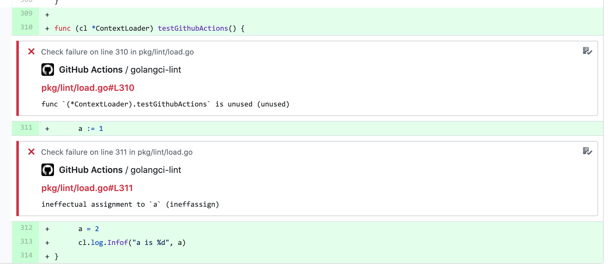

## CI installation

Most installations of `golangci-lint` are performed for CI.

### GitHub Actions

We recommend using [our GitHub Action](https://github.com/golangci/golangci-lint-action) for running `golangci-lint` in CI for GitHub projects.
It's [fast and uses smart caching](https://github.com/golangci/golangci-lint-action#performance) inside
and it can be much faster than the simple binary installation.

Also, the action creates GitHub annotations for found issues: you don't need to dig into build log to see found by `golangci-lint` issues:



### Other CI

It's important to have reproducible CI: don't start to fail all builds at the same time.
With golangci-lint this can happen if you use option `--enable-all` and a new linter is added
or even without `--enable-all` when one upstream linter is upgraded.

**IMPORTANT**: It's highly recommended installing a specific version of golangci-lint available on the [releases page](https://github.com/golangci/golangci-lint/releases).

Here is the recommended way to install golangci-lint {.LatestVersion}:

```sh
# binary will be $(go env GOPATH)/bin/golangci-lint
curl -sSfL https://raw.githubusercontent.com/golangci/golangci-lint/master/install.sh | sh -s -- -b $(go env GOPATH)/bin {.LatestVersion}

# or install it into ./bin/
curl -sSfL https://raw.githubusercontent.com/golangci/golangci-lint/master/install.sh | sh -s {.LatestVersion}

# In alpine linux (as it does not come with curl by default)
wget -O- -nv https://raw.githubusercontent.com/golangci/golangci-lint/master/install.sh | sh -s {.LatestVersion}

golangci-lint --version
```

It is advised that you periodically update the version of `golangci-lint` as the project is under active development
and is constantly being improved. For any problems with `golangci-lint`, check out recent [GitHub issues](https://github.com/golangci/golangci-lint/issues) and update if needed.

## Local Installation

### macOS

You can install a binary release on macOS using [brew](https://brew.sh/):

```sh
brew install golangci-lint
brew upgrade golangci-lint
```

Note: Previously we used a [homebrew tap](https://github.com/golangci/homebrew-tap). We recommend using official formula instead of the tap, but sometimes the most recent release 
isn't immediately available via homebrew core due to manual updates that need to occur from homebrew core maintainers. In this case, the tap formula, which is updated automatically,
can be used to install the latest version of `golangci-lint`:

```sh
brew tap golangci/tap
brew install golangci/tap/golangci-lint
```

It can also be installed through [macports](https://www.macports.org/)
The macports installation mode is community driven, and not officially maintained by golangci team.

```sh
sudo port install golangci-lint
```

### Docker

```sh
docker run --rm -v $(pwd):/app -w /app golangci/golangci-lint:{.LatestVersion} golangci-lint run -v
```

### Linux and Windows

```sh
# binary will be $(go env GOPATH)/bin/golangci-lint
curl -sSfL https://raw.githubusercontent.com/golangci/golangci-lint/master/install.sh | sh -s -- -b $(go env GOPATH)/bin {.LatestVersion}

golangci-lint --version
```

On Windows, you can run the above commands with Git Bash, which comes with [Git for Windows](https://git-scm.com/download/win).

### Install from Source

Note: such `go get` installation aren't guaranteed to work. We recommend using binary installation.
<details>
<summary>Why?</summary>

`go get` installation isn't recommended because of the following points:

1. some users use `-u` flag for `go get`, which upgrades our dependencies. Resulting configuration wasn't tested and isn't guaranteed to work.
2. [`go.mod`](https://github.com/golangci/golangci-lint/blob/master/go.mod) replacement directive doesn't apply. It means a user will be using patched version of `golangci-lint` if we use such replacements.
3. it's stability depends on a user's Go version (e.g. on [this compiler Go <= 1.12 bug](https://github.com/golang/go/issues/29612)).
4. we've encountered a lot of issues with Go modules hashes.
5. it allows installation from `master` branch which can't be considered stable.
6. it's slower than binary installation

</details>

<div style="margin-top: 2em;">

```sh
go get github.com/golangci/golangci-lint/cmd/golangci-lint@{.LatestVersion}
```

</div>

## Versioning Policy

`golangci-lint` follows [semantic versioning](https://semver.org). However, due to the nature of `golangci-lint` as a code quality tool,
it's not always clear when a minor or major version bump occurs. To help clarify this for everyone, we've defined the following semantic versioning policy:

- Patch release (intended to not break your lint build)
  - A patch version update in a specific linter that results in `golangci-lint` reporting fewer errors.
  - A bug fix to the CLI or core (packages loading, runner, postprocessors, etc).
  - Improvements to documentation.
  - Non-user-facing changes such as refactoring code, adding, deleting, or modifying tests, and increasing test coverage.
  - Re-releasing after a failed release (i.e., publishing a release that doesn't work for anyone).
- Minor release (might break your lint build because of newly found issues)
  - A major or minor version update of a specific linter that results in `golangci-lint` reporting more errors.
  - A new linter is added.
  - An existing configuration option or linter is deprecated.
  - A new CLI command is created.
  - Backward incompatible change of configuration with extremely low impact, e.g. adding validation of a list of enabled `go-critic` checkers.
- Major release (likely to break your lint build)
  - Backward incompatible change of configuration with huge impact, e.g. removing excluding issues about missed comments from `golint` by default.
  - A linter is removed.

According to our policy, any minor update may report more errors than the previous release (ex: from a bug fix).
As such, we recommend using the fixed minor version and fixed or the latest patch version to guarantee the results of your builds.

For example, in our [GitHub Action](https://github.com/golangci/golangci-lint-action) we require users to explicitly set the minor version of `golangci-lint`
and we always use the latest patch version.

## Next

[Quick Start: how to use `golangci-lint`](/usage/quick-start).
