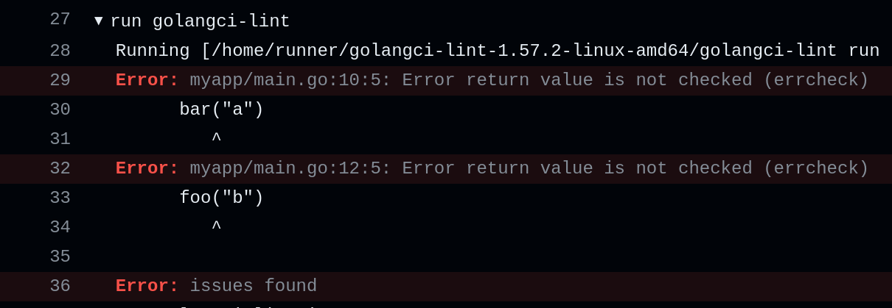

## CI installation

Most installations of `golangci-lint` are performed for CI.

It's important to have reproducible CI: don't start to fail all builds at the same time.
With golangci-lint this can happen if you use option `linters.default: all` and a new linter is added
or even without `linters.default: all` when one upstream linter is upgraded.

**IMPORTANT**: It's highly recommended installing a specific version of golangci-lint available on the [releases page](https://github.com/golangci/golangci-lint/releases).

### GitHub Actions

We recommend using [our GitHub Action](https://github.com/golangci/golangci-lint-action) for running `golangci-lint` in CI for GitHub projects.

It's [fast and uses smart caching](https://github.com/golangci/golangci-lint-action#performance) inside,
and it can be much faster than the simple binary installation.



Also, the action creates GitHub annotations for found issues (you don't need to dig into build log to see found by `golangci-lint` issues):


### GitLab CI

GitLab provides a [guide for integrating golangci-lint into the Code Quality widget](https://docs.gitlab.com/ci/testing/code_quality/#golangci-lint).
A simple quickstart is their [CI component](https://gitlab.com/explore/catalog/components/code-quality-oss/codequality-os-scanners-integration), which can be used like this:

```yaml .gitlab-ci.yml
include:
  - component: $CI_SERVER_FQDN/components/code-quality-oss/codequality-os-scanners-integration/golangci@1.0.1
```

Note that you [can only reference components in the same GitLab instance as your project](https://docs.gitlab.com/ci/components/#use-a-component)

### Other CI

Here is the other way to install golangci-lint:

```bash
# binary will be $(go env GOPATH)/bin/golangci-lint
curl -sSfL https://raw.githubusercontent.com/golangci/golangci-lint/HEAD/install.sh | sh -s -- -b $(go env GOPATH)/bin {.LatestVersion}

# or install it into ./bin/
curl -sSfL https://raw.githubusercontent.com/golangci/golangci-lint/HEAD/install.sh | sh -s {.LatestVersion}

# In Alpine Linux (as it does not come with curl by default)
wget -O- -nv https://raw.githubusercontent.com/golangci/golangci-lint/HEAD/install.sh | sh -s {.LatestVersion}

golangci-lint --version
```

It is advised that you periodically update the version of `golangci-lint` as the project is under active development
and is constantly being improved. For any problems with `golangci-lint`, check out recent [GitHub issues](https://github.com/golangci/golangci-lint/issues) and update if needed.

## Local Installation

[](https://repology.org/project/golangci-lint/versions)

### Binaries

```bash
# binary will be $(go env GOPATH)/bin/golangci-lint
curl -sSfL https://raw.githubusercontent.com/golangci/golangci-lint/HEAD/install.sh | sh -s -- -b $(go env GOPATH)/bin {.LatestVersion}

golangci-lint --version
```

On Windows, you can run the above commands with Git Bash, which comes with [Git for Windows](https://git-scm.com/download/win).

### Linux

Golangci-lint is available inside the majority of the package managers.

### macOS

#### Homebrew

Note: Homebrew can use an unexpected version of Go to build the binary,
so we recommend either using our binaries or ensuring the version of Go used to build.

You can install a binary release on macOS using [brew](https://brew.sh/):

```bash
brew install golangci-lint
brew upgrade golangci-lint
```

Note: Previously, we used a [Homebrew tap](https://github.com/golangci/homebrew-tap).
We recommend using the [official formula](https://formulae.brew.sh/formula/golangci-lint) instead of the tap,
but sometimes the most recent release isn't immediately available via Homebrew core due to manual updates that need to occur from Homebrew core maintainers.
In this case, the tap formula, which is updated automatically,
can be used to install the latest version of `golangci-lint`:

```bash
brew tap golangci/tap
brew install golangci/tap/golangci-lint
```

#### MacPorts

It can also be installed through [MacPorts](https://www.macports.org/)
The MacPorts installation mode is community driven, and not officially maintained by golangci team.

```bash
sudo port install golangci-lint
```

### Windows

#### Chocolatey

You can install a binary on Windows using [chocolatey](https://community.chocolatey.org/packages/golangci-lint).

```bash
choco install golangci-lint
```

#### Scoop

You can install a binary on Windows using [scoop](https://scoop.sh).

```bash
scoop install main/golangci-lint
```

The scoop package is not officially maintained by golangci team.

### Docker

```bash
docker run --rm -v $(pwd):/app -w /app golangci/golangci-lint:{.LatestVersion} golangci-lint run
```

Colored output:
```bash
docker run -t --rm -v $(pwd):/app -w /app golangci/golangci-lint:{.LatestVersion} golangci-lint run
```

Preserving caches between consecutive runs:
```bash
docker run --rm -t -v $(pwd):/app -w /app \
--user $(id -u):$(id -g) \
-v $(go env GOCACHE):/.cache/go-build -e GOCACHE=/.cache/go-build \
-v $(go env GOMODCACHE):/.cache/mod -e GOMODCACHE=/.cache/mod \
-v ~/.cache/golangci-lint:/.cache/golangci-lint -e GOLANGCI_LINT_CACHE=/.cache/golangci-lint \
golangci/golangci-lint:{.LatestVersion} golangci-lint run
```

### Install from Sources

Using `go install`/`go get`, "tools pattern", and `tool` command/directives installations aren't guaranteed to work.

We recommend using binary installation.

These installations aren't recommended because of the following points:

1. These installations compile golangci-lint locally. The Go version used to build will depend on your local Go version.
2. Some users use the `-u` flag for `go get`, which upgrades our dependencies. The resulting binary was not tested and is not guaranteed to work.
3. When using the "tools pattern" or `tool` command/directives, the dependencies of a tool can modify the dependencies of another tool or your project. The resulting binary was not tested and is not guaranteed to work.
4. We've encountered issues with Go module hashes due to the unexpected recreation of dependency tags.
5. `go.mod` replacement directives don't apply transitively. It means a user will be using a patched version of `golangci-lint` if we use such replacements.
6. It allows installation from the main branch, which can't be considered stable.
7. It's slower than binary installation.

```bash
go install github.com/golangci/golangci-lint/v2/cmd/golangci-lint@{.LatestVersion}
```

<details>
<summary>`go tool` usage recommendations</summary>

We don't recommend using `go tool`.

But if you want to use `go tool` to install and run golangci-lint (once again we don't recommend that),
the best approach is to use a dedicated module or module file to isolate golangci-lint from other tools or dependencies.

This approach avoids modifying your project dependencies and the golangci-lint dependencies.

**⚠️ IMPORTANT ⚠️: You should never update golangci-lint dependencies manually.**

**Method 1: dedicated module file**

```sh
# Create a dedicated module file
go mod init -modfile=golangci-lint.mod <your_module_path>/golangci-lint
# Example: go mod init -modfile=golangci-lint.mod github.com/org/repo/golangci-lint
```

```sh
# Add golangci-lint as a tool
go get -tool -modfile=golangci-lint.mod github.com/golangci/golangci-lint/v2/cmd/golangci-lint@{.LatestVersion}
```

```sh
# Run golangci-lint as a tool
go tool -modfile=golangci-lint.mod golangci-lint run
```

```sh
# Update golangci-lint
go get -tool -modfile=golangci-lint.mod github.com/golangci/v2/golangci-lint/cmd/golangci-lint@latest
```

**Method 2: dedicated module**

```sh
# Create a dedicated directory
mkdir golangci-lint
```

```sh
# Create a dedicated module file
go mod init -modfile=tools/go.mod <your_module_path>/golangci-lint
# Example: go mod init -modfile=golangci-lint/go.mod github.com/org/repo/golangci-lint
```

```sh
# Setup a Go workspace
go work init . golangci-lint
```

```sh
# Add golangci-lint as a tool
go get -tool -modfile=golangci-lint/go.mod github.com/golangci/golangci-lint/v2/cmd/golangci-lint
```

```sh
# Run golangci-lint as a tool
go tool golangci-lint run
```

```sh
# Update golangci-lint
go get -tool -modfile=golangci-lint/go.mod github.com/golangci/golangci-lint/v2/cmd/golangci-lint@latest
```

</details>

## Next

[Quick Start: how to use `golangci-lint`](/welcome/quick-start/).
